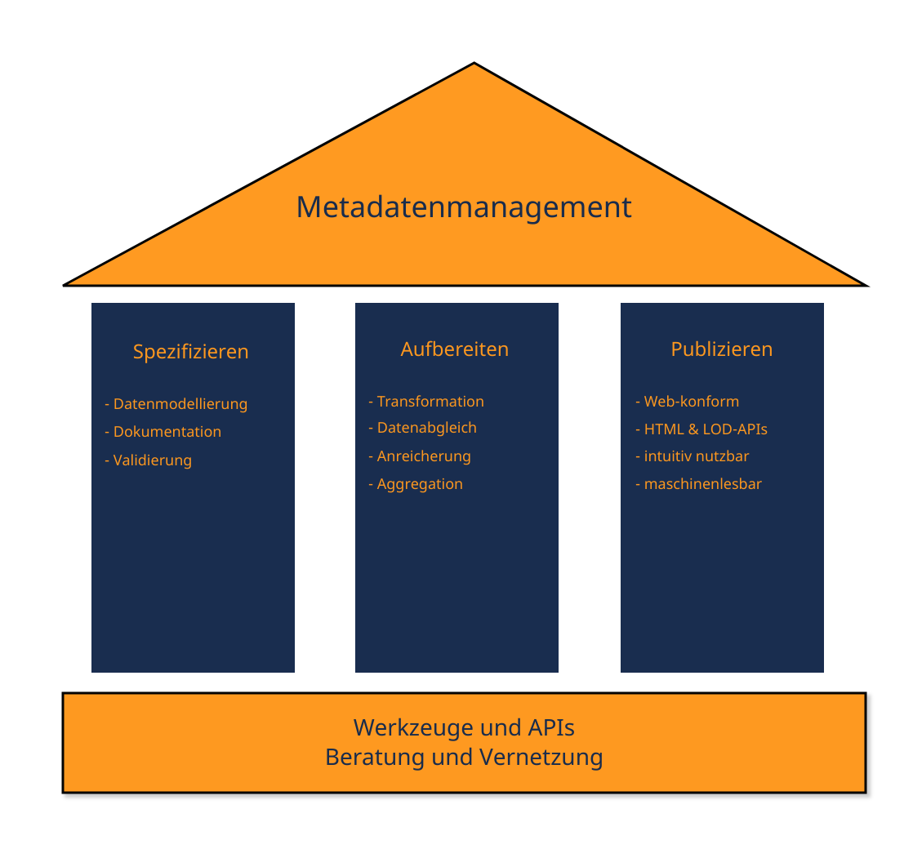

- ### Automatisierte Verarbeitung und webbasierte Publikation von Metadaten
  Das hbz blickt auf langjährige Erfahrung zurück in der automatisierten Verarbeitung von Metadaten und der Publikation leicht nutzbarer Metadaten im Web. Es hat sich an verschiedenen Initiativen zur community-gestützten Entwicklung geteilter Metadatenstandards, deren Spezifikation und Dokumentation beteiligt.
  
  Unser Angebot gliedert sich demgemäß in drei Aufgabenbereiche:
  * [[Metadaten spezifizieren]]
  * [[Metadaten aufbereiten]]
  * [[Metadaten publizieren]]
  
  
  Kontakt: ((62220b37-8300-46f3-b4be-a6cc66dc60d0))